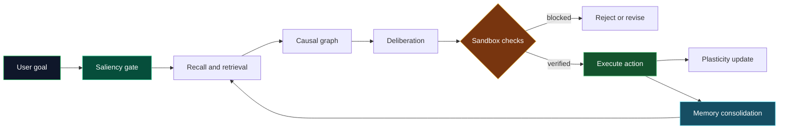

<div align="center">

# AutoAgent

### A guarded, bio-inspired cognitive runtime for grounded reasoning, memory, and execution

<p>
  <a href="https://github.com/shaikIrfan87/AutoAgent"></a>
  <a href="https://github.com/shaikIrfan87/AutoAgent/issues"></a>
  
  
</p>

<p>
  
</p>

<p><em>Research-grade infrastructure for experiments in autonomous agents and cognitive systems.</em></p>

</div>

> AutoAgent is an experimental platform. It is designed to make cognitive behavior inspectable and testable, not to promise human-level general intelligence or production safety by default.

## What It Does

AutoAgent turns a user goal into a guarded cognitive cycle. Inputs are screened for saliency and epistemic quality, related knowledge is retrieved, candidate actions are evaluated against causal and safety constraints, and successful outcomes can be consolidated into persistent memory.

The project combines:

- **Epistemic gating and saliency** for deciding what deserves attention.
- **Neuro-symbolic causal reasoning** for relationships, constraints, and intervention checks.
- **Closed-loop sandbox execution** with AST and host-commit guardrails.
- **Bounded synaptic plasticity** using fast weights and Oja-style normalization.
- **Persistent memory consolidation** backed by SQLite/WAL and hybrid retrieval.

## Core Invariants

| # | Invariant | Role | Primary implementation |
|---|---|---|---|
| 1 | Saliency and epistemic gating | Filter, rank, and ground incoming information | [`saliency.py`](cognitive_engine/core/saliency.py) |
| 2 | Causal symbolic graph | Represent relations, axioms, and interventions | [`causal_graph.py`](cognitive_engine/core/causal_graph.py) |
| 3 | Environmental sandbox | Constrain generated actions and execution | [`sandbox.py`](cognitive_engine/core/sandbox.py) |
| 4 | Bounded plasticity | Adapt fast weights without unbounded drift | [`plastic_layer.py`](cognitive_engine/core/plastic_layer.py) |
| 5 | Episodic consolidation | Persist, decay, and retrieve verified memories | [`consolidation.py`](cognitive_engine/core/consolidation.py) |

## Cognitive Flow



## Interfaces

| Interface | Command or endpoint | Best for |
|---|---|---|
| Interactive CLI | `python run.py` | Conversational exploration and local experiments |
| Single query | `python run.py "your query"` | Scripts and quick checks |
| Autonomous mode | `python run.py --autonomous` | Long-running learning experiments |
| Live verification | `python run.py --test` | Cognitive pipeline smoke checks |
| FastAPI / MCP server | `python run.py --server` | HTTP, WebSocket, and tool integrations |
| Browser console | `python web_server.py` | Interactive UI and telemetry |

## Quick Start

### 1. Clone the repository

```bash
git clone https://github.com/shaikIrfan87/AutoAgent.git
cd AutoAgent
```

### 2. Create an isolated environment

```bash
python -m venv .venv
```

Windows PowerShell:

```powershell
\.venv\Scripts\Activate.ps1
```

macOS/Linux:

```bash
source .venv/bin/activate
```

### 3. Install the engine

```bash
python -m pip install --upgrade pip
python -m pip install -e ./cognitive_engine
```

For the web server and API tests, install the web dependencies as well:

```bash
python -m pip install fastapi uvicorn httpx pytest
```

### 4. Start AutoAgent

```bash
# Interactive CLI
python run.py

# Or start the browser/API service
python web_server.py
```

Open `http://127.0.0.1:8000` for the web console when the server is running.

## CLI Examples

```text
AutoAgent> explain the current state of the memory system
AutoAgent> test
AutoAgent> demo
AutoAgent> help
AutoAgent> exit
```

The unified entry point also supports direct execution:

```bash
python run.py "compare two approaches and verify the result"
python run.py --test
python run.py --server
```

## API Surface

The browser service in [`web_server.py`](web_server.py) exposes a small, inspectable API:

| Method | Route | Purpose |
|---|---|---|
| `GET` | `/` | Serve the web console |
| `GET` | `/api/telemetry` | Read invariant and memory telemetry |
| `POST` | `/api/interact` | Process a single query |
| `POST` | `/api/interact/stream` | Stream deliberation events over SSE |

Example request:

```bash
curl -X POST http://127.0.0.1:8000/api/interact ^
  -H "Content-Type: application/json" ^
  -d "{\"query\":\"What is currently stored in memory?\"}"
```

For the FastAPI application and WebSocket/MCP integrations, see [`cognitive_engine/api.py`](cognitive_engine/api.py) and [`cognitive_engine/core/mcp_server.py`](cognitive_engine/core/mcp_server.py).

## Repository Map

```text
AutoAgent/
├── cognitive_engine/       Core runtime, agent orchestration, and services
│   ├── agent/               Planning, deliberation, curiosity, and synthesis
│   ├── core/                Five invariants and supporting primitives
│   └── service/             Service-layer interfaces
├── features/                Focused feature implementations and boundaries
├── self_eval_engine/        Verifiers, consensus, credit, and self-evaluation
├── skills/                  Tenant-scoped and composable executable skills
├── tests/                   Unit, integration, adversarial, and endurance tests
├── benchmarks/              Performance, ARC, realtime, and soak experiments
├── web/                     Browser console assets
├── assets/                  DSL macros and local runtime data
├── run.py                   Unified CLI and server entry point
└── web_server.py            FastAPI browser/telemetry service
```

## Testing

Run the repository test suite from the project root:

```bash
python -m pytest
```

Run only the live verification path:

```bash
python run.py --test
```

The repository also contains focused suites for sandbox containment, memory stress, plasticity, adversarial ingress, API behavior, autonomous loops, and endurance testing. Long-running benchmarks can consume substantial CPU, memory, or disk space; run them deliberately.

## Design Principles

- **Ground before action:** retrieval and evidence are part of the reasoning path.
- **Make failure explicit:** invariant failures should stop or redirect execution.
- **Keep adaptation bounded:** learning must not silently destabilize the runtime.
- **Persist only useful traces:** memory is consolidated from verified outcomes.
- **Prefer inspectable interfaces:** CLI, API, telemetry, tests, and reports expose the system’s state.

## Documentation

- [Complete architecture manual](AutoAgent_Complete_Architecture_Manual.pdf)
- [System architecture report](AutoAgent_System_Architecture_Report.pdf)
- [Cognitive engine package metadata](cognitive_engine/pyproject.toml)
- [Test configuration](pytest.ini)

## Project Status

AutoAgent is under active research and development. APIs, runtime behavior, and experimental modules may change. Results from autonomous, sandbox, and endurance modes should be treated as experimental until independently reviewed in the target environment.

## Contributing

1. Create a focused branch for your change.
2. Add or update a focused test when behavior changes.
3. Run `python -m pytest` from the repository root.
4. Explain the invariant or boundary affected by the change in the pull request.

Please open an issue before large architectural changes so the design can be discussed in context.

## License

No license file is currently present in the repository. Add a license before publishing the project for reuse so GitHub and downstream users have clear legal terms.

<div align="center">

<br>


<sub>Built for experiments where reasoning should be observable, bounded, and testable.</sub>

</div>